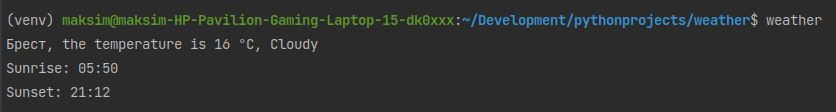

# <div align="center">Weather script ⛅</div>

<div align="center">

</div>

<br/>

I watched a video on how to improve the quality of my code. After watching it, I tried to put the acquired skills into
practice. I wrote a script that shows it instantly, defining it globally, so I can call it from any directory. I tried
to document the code as much as possible, apply typing, break functions into auxiliary functions and follow the rule
of good code.

## Description

<div align="center">

</div>
<br/>

My weather script, by entering the weather command, instantly displays the current temperature, the presence of
precipitation, the time of sunrise and sunset according to your geolocation. In addition, it saves the data in a txt or
json file.

## Technologies

***Language***


***Libraries***


***Other***


The primary task was to obtain the longitude and latitude of the user, for which I used the geocoder library that
retrieves coordinates based on IP. Next, I passed the obtained data to an API request to the OpenWeather service, which
returns weather information in JSON format. Then, I parsed the JSON string and extracted the temperature, sunrise and
sunset times, precipitation, and displayed the obtained data in the console. Finally, I decided to add functions for
saving the results in TXT and JSON formats.

## Project setup

***Via virtual environment***

1. Create and activate a python virtual environment
2. In the terminal, enter the following command:

```
pip3 install -r requirements.txt
```

3. Create a .env file and paste the data from the .env.example file into it
4. Sign up to OpenWeather service and add your API key into .env file
5. Run the "weather" file

## <div align="center">Sunny weather for you!👋</div>